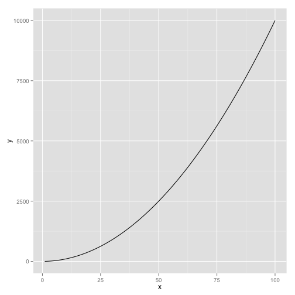

## Example goes here

Hi! I should put an example here.

Here's something silly in the meantime:


```r
library(ggplot2)
```

```
## Loading required package: methods
```

```r
ggplot(data.frame(x = 1:100, y = (1:100)^2)) + geom_line(aes(x = x, y = y))
```

 


